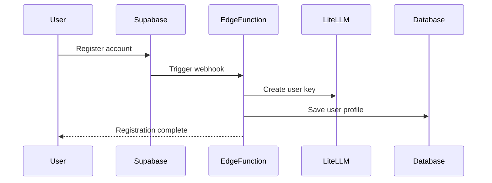
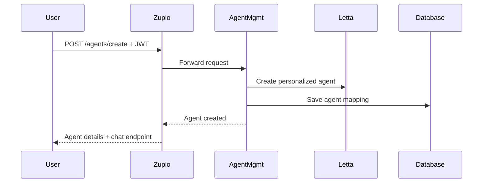
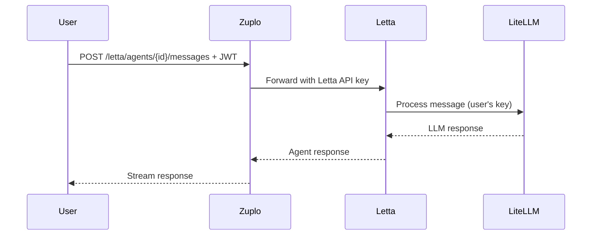

# AI Agent Platform API Gateway

Unified Zuplo API Gateway для персональных AI агентов с интеграцией LiteLLM биллинга, прокси к Letta Server и Agent Management Service.

## 🏗️ Архитектура

```
Frontend → Zuplo Gateway → Letta Server (chat)
    ↓           ↓              ↓
   JWT     User Auth      Letta API
  Token      Check          Key
    
    ↓           ↓              ↓
   Zuplo → Agent Mgmt → Create Agent
              Service
```

## 📋 Возможности

- ✅ **Agent Proxy** - проксирование LLM запросов с биллингом по пользователям
- ✅ **Letta Server Proxy** - прямой доступ к Letta API для управления диалогами
- ✅ **Agent Management** - создание персонализированных агентов
- ✅ **User Authentication** - JWT токены от Supabase
- ✅ **Service Authentication** - защищенные внутренние API
- ✅ **Rate Limiting** - контроль нагрузки по пользователям
- ✅ **Health Checks** - мониторинг состояния системы
- ✅ **Structured Logging** - детальные логи всех операций

## 🛠️ Установка

### Локальная разработка

```bash
# Установка зависимостей
npm install

# Копирование конфигурации
cp .env.example .env

# Запуск в dev режиме
npm run dev
# Доступно на http://localhost:9000
```

### Деплой в Zuplo Cloud

```bash
# Авторизация
zuplo link

# Деплой
zuplo deploy
```

## ⚙️ Конфигурация

Скопируйте `.env.example` в `.env` и настройте:

### Основные переменные

```env
# Supabase (обязательно)
SUPABASE_URL=https://your-project.supabase.co
SUPABASE_SERVICE_ROLE_KEY=your-service-role-key  
SUPABASE_JWT_SECRET=your-jwt-secret

# Letta Server (обязательно)
LETTA_BASE_URL=https://your-letta-server.com
LETTA_API_KEY=your-letta-api-key

# Agent Management Service (обязательно)
AGENT_MANAGEMENT_URL=https://your-agent-service.com
AGENT_MANAGEMENT_API_KEY=your-service-api-key

# LiteLLM (обязательно для биллинга)
LITELLM_BASE_URL=https://your-litellm-proxy.com

# Ключи аутентификации
AGENT_SECRET_KEY=your-super-secret-agent-key
SERVICE_SECRET_KEY=your-internal-service-key
```

## 🔌 API Endpoints

### System Endpoints

| Method | Endpoint | Description |
|--------|----------|-------------|
| `GET` | `/` | API информация |
| `GET` | `/health` | Health check |
| `GET` | `/docs` | Swagger документация |

### Agent Proxy (существующий)

| Method | Endpoint | Auth | Description |
|--------|----------|------|-------------|
| `POST` | `/api/v1/agents/{userid}/messages` | Agent Secret | Прокси к LiteLLM с биллингом |

### Letta Server Proxy (новое)

| Method | Endpoint | Auth | Description |
|--------|----------|------|-------------|
| `GET` | `/api/v1/letta/agents` | JWT | Список агентов пользователя |
| `GET` | `/api/v1/letta/agents/{agent_id}` | JWT | Детали агента |
| `PATCH` | `/api/v1/letta/agents/{agent_id}` | JWT | Обновить агента |
| `POST` | `/api/v1/letta/agents/{agent_id}/messages` | JWT | Отправить сообщение |
| `GET` | `/api/v1/letta/agents/{agent_id}/messages` | JWT | История сообщений |

### Agent Management (новое)

| Method | Endpoint | Auth | Description |
|--------|----------|------|-------------|
| `POST` | `/api/v1/agents/create` | JWT | Создать персонализированного агента |
| `GET` | `/api/v1/agents/status` | JWT | Статус агента пользователя |

## 🔐 Аутентификация

### 1. User JWT Authentication (для фронтенда)

```javascript
// В заголовках запросов от фронтенда
const headers = {
  'Authorization': `Bearer ${userJwtToken}`,
  'Content-Type': 'application/json'
};
```

### 2. Agent Secret Authentication (для агентов)

```javascript 
// Для прокси агентов к LiteLLM
const headers = {
  'Authorization': `Bearer ${AGENT_SECRET_KEY}`,
  'Content-Type': 'application/json'  
};
```

### 3. Service Authentication (внутренние сервисы)

```javascript
// Для внутренних API запросов
const headers = {
  'Authorization': `Bearer ${SERVICE_SECRET_KEY}`,
  'Content-Type': 'application/json'
};
```

## 📱 Примеры использования

### Регистрация и создание агента

```javascript
// 1. Пользователь регистрируется в Supabase Auth
// 2. Edge Function автоматически создает LiteLLM ключ
// 3. Пользователь заполняет профиль и создает агента

const createAgent = async (userToken, personalInfo) => {
  const response = await fetch('/api/v1/agents/create', {
    method: 'POST',
    headers: {
      'Authorization': `Bearer ${userToken}`,
      'Content-Type': 'application/json'
    },
    body: JSON.stringify({ personalInfo })
  });
  
  const result = await response.json();
  // result.chat_endpoint - URL для чата с агентом
  return result;
};
```

### Чат с агентом через Letta

```javascript
const sendMessage = async (userToken, agentId, message) => {
  const response = await fetch(`/api/v1/letta/agents/${agentId}/messages`, {
    method: 'POST',
    headers: {
      'Authorization': `Bearer ${userToken}`,
      'Content-Type': 'application/json'
    },
    body: JSON.stringify({
      message: message,
      stream: true
    })
  });
  
  // Обработка streaming ответа
  const reader = response.body.getReader();
  // ...
};
```

### Получение истории сообщений

```javascript
const getMessages = async (userToken, agentId, limit = 50) => {
  const response = await fetch(`/api/v1/letta/agents/${agentId}/messages?limit=${limit}`, {
    headers: {
      'Authorization': `Bearer ${userToken}`
    }
  });
  
  return response.json();
};
```

## 🎯 User Journey

### 1. **Регистрация пользователя**


### 2. **Создание агента**


### 3. **Чат с агентом**


## 🔧 Мониторинг

- **Health Checks**: `GET /health` - статус всех сервисов
- **Logs**: Доступны в Zuplo Dashboard 
- **Metrics**: LiteLLM Dashboard показывает биллинг по пользователям
- **Tracing**: Все запросы содержат correlation ID

## 🚦 Rate Limiting

- **Per User**: 100 requests/minute для authenticated пользователей
- **Per Agent**: Настраивается индивидуально
- **Global**: Защита от DDoS атак

## 🔒 Безопасность

- **JWT Validation** - все пользовательские запросы проходят проверку
- **Service Keys** - защищенные внутренние API
- **Rate Limiting** - защита от злоупотреблений
- **Request Logging** - аудит всех операций
- **CORS Policies** - настроенные политики CORS

## 🧪 Тестирование

### Локальное тестирование

```bash
# Health check
curl http://localhost:9000/health

# Создание агента (нужен валидный JWT)
curl -X POST "http://localhost:9000/api/v1/agents/create" \
  -H "Authorization: Bearer YOUR_JWT_TOKEN" \
  -H "Content-Type: application/json" \
  -d '{
    "personalInfo": {
      "name": "Test User",
      "interests": ["programming", "AI"],
      "communicationStyle": "friendly"
    }
  }'

# Отправка сообщения через Letta
curl -X POST "http://localhost:9000/api/v1/letta/agents/AGENT_ID/messages" \
  -H "Authorization: Bearer YOUR_JWT_TOKEN" \
  -H "Content-Type: application/json" \
  -d '{
    "message": "Hello!",
    "stream": false
  }'
```

## 📁 Структура проекта

```
agent-proxy-zuplo/
├── config/
│   ├── routes.oas.json      # API маршруты и схемы
│   └── policies.json        # Политики безопасности
├── modules/
│   ├── agent-auth-proxy.ts  # Прокси агентов к LiteLLM  
│   ├── service-auth.ts      # Аутентификация сервисов
│   ├── add-auth-headers.ts  # Добавление API ключей
│   ├── health-check.ts      # Health endpoint
│   └── api-info.ts         # API информация
├── tests/                   # Тесты
├── .env.example            # Пример конфигурации
├── package.json            # Зависимости
└── README.md              # Эта документация
```

## 🔄 Troubleshooting

### Частые проблемы

**401 Unauthorized на JWT endpoints:**
- Проверьте `SUPABASE_JWT_SECRET`
- Убедитесь что JWT токен валиден
- Проверьте формат заголовка: `Bearer <token>`

**403 Forbidden на Agent Management:**
- Проверьте `AGENT_MANAGEMENT_API_KEY`
- Убедитесь что сервис доступен

**502/503 на Letta endpoints:**
- Проверьте `LETTA_BASE_URL` и `LETTA_API_KEY`
- Проверьте доступность Letta Server

### Логирование

Все операции логируются с контекстом:
- User ID (из JWT или Agent Secret)
- Operation type
- Response times
- Error details

Логи доступны в Zuplo Dashboard → Analytics → Logs

## 🛣️ Roadmap

### Планы развития

- [ ] **WebSocket Support** - real-time чат
- [ ] **File Upload** - поддержка файлов в чате
- [ ] **Agent Templates** - готовые шаблоны агентов  
- [ ] **Usage Analytics** - детальная аналитика пользователей
- [ ] **Multi-tenant Support** - поддержка организаций
- [ ] **Plugin System** - расширяемость через плагины

---

**AI Agent Platform** - это современная платформа для персональных AI ассистентов с enterprise-grade безопасностью, масштабируемостью и мониторингом.
